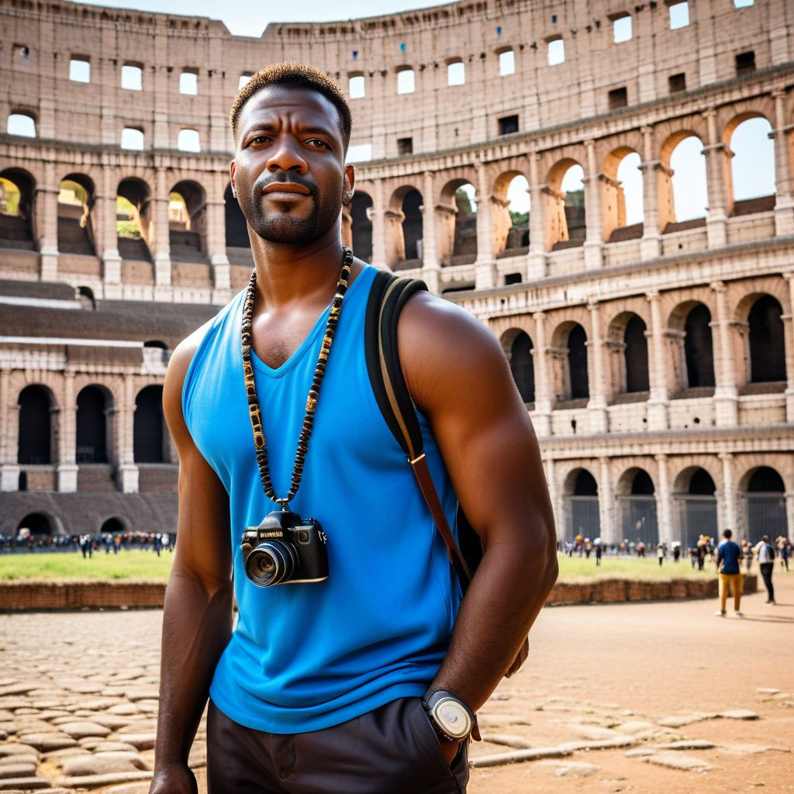
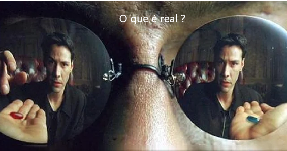

🌍 **DE BANGU AO COLISEU: O SONHO SE TORNA REALIDADE!** 🏛️✨  

Eu sempre fui aquele moleque sonhador da Zona Oeste do Rio, criado na correria, estudando em escola pública e ajudando minha família desde cedo. A grana era curta, mas eu tinha um sonho grande: um dia, conhecer Roma e ver de perto o Coliseu. 💭✨ 

Esse sonho me acompanhou desde criança, quando eu via fotos e documentários sobre gladiadores e a história incrível por trás daquela arena. Eu sabia que, pra chegar lá, precisaria ralar MUITO e planejar cada centavo. Foi aí que o **Excel** entrou na minha vida. 📊🔥  

Eu comecei a anotar minhas economias no Excel e criei tabelas pra organizar o quanto precisava guardar e gastar. No início, eu mal sabia fazer uma soma, mas com o tempo, virei praticamente um ninja das planilhas! 💻⚡ Isso me abriu portas: consegui um emprego como analista de dados na Caixa Econômica Federal.  

Minha missão? Criar pacotes de viagens para premiar os funcionários destaque. 🚀💼 E olha só: usando o Excel, montei um banco de dados COMPLETO, com roteiros para o mundo inteiro. 🌎 Ficou tão incrível que o chefe quis me premiar... e adivinha qual foi o destino?  

**ROMA, BABY!** 🇮🇹❤️  

Finalmente, realizei meu sonho. Andei pelas ruas históricas, provei gelatos inesquecíveis e fiquei frente a frente com o Coliseu. Foi surreal. 🏛️✨  

Moral da história? Não importa de onde você vem, o tamanho dos seus sonhos é o que define até onde você pode ir. Sonhe grande, planeje, corra atrás... e confie no processo. 🙌  

Se eu consegui, você também pode! 🚀💡  

#Roma #Sonhos #Motivação #Inspiração #ExcelMudouMinhaVida #Coliseu #ZonaOesteRJ #NuncaDesista

E agora, me diz aí, seguindo a hype Natty or Not, esta história é verdadeira ou não? 🤔

## 🚀 Introdução

> Woooow! Look at this 👀

Olá pessoal, meu nome é Guto e sou aluno do BootCamp da CAIXA - IA Generativa com Microsoft Copilot da [DIO](https://dio.me)! Inspirado na hype _"Natty or Not"_ construi este texto com o auxilio de uma IA Generativa, explorando o potencial dessas tendências tecnológicas incríveis.

## 💻 Tecnologias utilizadas no projeto

- [ChatGPT](https://chat.openai.com/) 
- [Monica](https://monica.im/home)

## ✨ Como foi feito ?

- O chatgpt foi utilizado para gerar o texto estilo post da história
- A Monica IA foi utilizado para gerar imagem

## 💭 Reflexão

Este projeto tem como propósito mostrar que no contexto atual com o advento de várias tecnologias, fica cada vez mais dificil conceber o que é realidade dentro deste infinito universo de informação no mundo digital.

## 👨‍💻 Novato

    
    
&nbspGutembergue Martins &nbsp
    &nbsp;
    <a 
        href="<a href="https://www.linkedin.com/in/gutembergue-martins-38336a59" target="_blank">LinkedIn</a>
    

  

## Links Interessantes

[Base10: If You’re Not First, You’re Last: How AI Becomes Mission Critical](https://base10.vc/post/generative-ai-mission-critical/)

